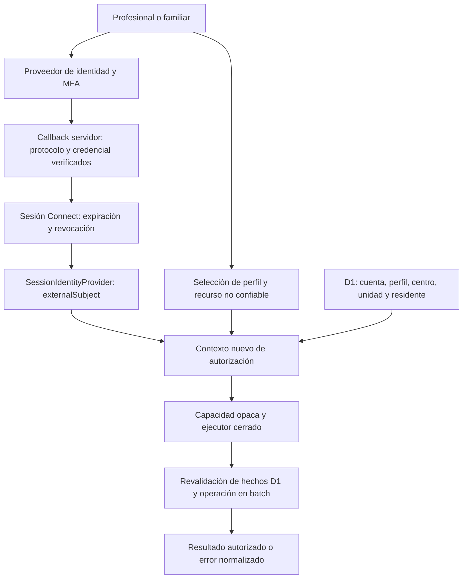

# ADR 0005 — Selección del proveedor de autenticación productiva

- **Estado: Propuesto**
- **Fecha:** 2026-09-08.
- **Consulta de fuentes oficiales:** 2026-09-07 y 2026-09-08. Tarifas en USD, sin impuestos.
- **Base examinada:** `5faa25f8a68bf0c64dcf264200dc9728d5ba017b`, inicialmente `HEAD = main = origin/main`; árbol limpio y referencia remota comprobada.
- **Rama documental:** `docs/authentication-provider-decision`.
- **Decisión pendiente:** propietario del producto, después de revisión técnica, de seguridad, de protección de datos y contractual.
- **Recomendación para esa revisión:** Auth0 con tenant europeo; WorkOS AuthKit como respaldo condicionado. No se acepta ni contrata ningún proveedor mediante este ADR.

## 1. Explicación para una persona no técnica

Estamos eligiendo quién comprobará que cada persona es quien dice ser al entrar en Connect y quién custodiará sus credenciales y segundos factores. Connect seguirá decidiendo qué puede consultar o hacer esa persona. Trabajar en dos centros o tener dos familiares residentes no dará permisos adicionales en el proveedor de acceso.

Proponemos estudiar primero Auth0 porque permite situar el núcleo de identidad en Europa y ofrece mecanismos de autenticación y soporte empresarial. Su principal incertidumbre es económica: las funciones de gestión de sesiones necesarias pueden llevar a Enterprise, sin tarifa pública suficiente. Las referencias públicas con MFA van de **35 a 545 USD/mes** para los volúmenes estudiados, pero **no son el presupuesto de una solución productiva completa**. WorkOS incluye autenticación básica y MFA sin cargo por usuarios en estos tamaños; dominio propio, SSO, soporte y operación añaden coste. Véase el cálculo reproducible del apartado 8. [A01] [A06] [W01]

Los riesgos abiertos son demostrar el funcionamiento con nuestro runtime, cerrar correctamente todas las sesiones robadas o revocadas, recuperar cuentas sin debilitar el segundo factor y conocer dónde se procesan los datos auxiliares. Elegir una región europea no garantiza que soporte, registros y copias permanezcan íntegramente en la UE. La elección del proveedor tampoco convierte el prototipo en un sistema sanitario apto para producción.

## 2. Contexto, fuentes internas y alcance

Gobierna la línea base [LBF-CONNECT-2026-09-06-V1.1](../product/baselines/2026-09-06-declaracion-linea-base-funcional-v1.1.md), junto con el [PRD v0.5](../product/2026-09-06-PRD-plataforma-contacto-familias-v0.5-consolidado.md), la [matriz de permisos v0.2.1](../product/permissions/2026-09-06-matriz-permisos-seis-perfiles-v0.2.1.md), los wireframes canónicos y [AGENTS.md v1.4](../../AGENTS.md). Se han revisado también [README](../../README.md), [índice documental](../README.md), [ADR 0001](0001-modelo-minimo-residente-basal.md), [contrato de datos 0002](0002-contrato-datos-residente-basal.md), [ADR 0003](0003-aprobacion-d1-drizzle.md) y [ADR 0004](0004-frontera-servidor-autorizacion-d1.md).

Los wireframes [Administración, ADM-09–13 y ADM-30](../product/wireframes/2026-09-06-wireframe-funcional-administracion-v0.3.md) y [Portal Familiar, FAM-01–03 y FAM-15–18](../product/wireframes/2026-09-05-wireframe-funcional-portal-familiar-v0.2.md) delimitan alta, recuperación, segundo factor, sesiones, selección de perfil y vínculos. AUTH-04 del PRD exige segundo factor antes de datos reales conforme a política validada; esto comprende también el portal familiar. No se rebaja ese requisito por coste o facilidad de uso.

La evolución multiorganización incluye residencias, centros de día y SAAD como contexto de selección de identidad. **No incorpora ahora los flujos específicos de centros de día o SAAD a la línea base funcional.** Tampoco amplía las facultades de Administración, Familia o Dirección.

El estudio modifica exclusivamente este documento. Impacto actual en interfaz, dominio ejecutable, permisos, persistencia, autenticación, arquitectura desplegada y dependencias: **ninguno**. Se ejecutan las validaciones existentes. Las futuras sesiones persistentes, integración, secretos, rutas o tablas mencionadas aquí son propuestas que necesitarán un bloque posterior autorizado.

Se conserva la delimitación de 0003/0004: `0001` está integrada e inmutable; solo se permite su aplicación local desechable con datos sintéticos. Las referencias históricas a persistencia todavía no aprobada no autorizan una aplicación remota. `D1-P04`–`D1-P06` continúan denegadas, sin botones, endpoints ni grants operativos.

### 2.1. Estado real examinado

| Evidencia local | Consecuencia para la elección |
| --- | --- |
| [package.json](../../package.json): Next.js 16.3.4, React 19.2.8, TypeScript 5.9.3, vinext 1.0.0-beta.9, Vite 8.2.2, Wrangler 4.128.0; Node 24.20.0 y pnpm 11.19.0 | Un ejemplo para Next.js alojado en Node no demuestra compatibilidad con esta combinación. |
| [wrangler.jsonc](../../wrangler.jsonc) y [vite.config.ts](../../vite.config.ts): Workers, `nodejs_compat`, entrada App Router de vinext y binding D1 local | La prueba futura debe ejecutar `workerd`, sus cookies y sus transiciones de petición. No basta el build de Next.js. |
| [SessionIdentityProvider](../../lib/session/session-provider.ts): `getVerifiedIdentity()` devuelve exclusivamente `{ externalSubject }` o `null` | Es el puerto del adaptador. Debe verificar autenticidad, caducidad y revocación antes de devolver identidad. No recibe roles ni permisos del proveedor. |
| [Proveedor sintético](../../lib/session/synthetic-session-provider.ts) y proveedor indisponible por defecto | No existe adaptador productivo en esta frontera. La referencia SIWC/ChatGPT del prototipo no equivale a una integración aceptada aquí. |
| [Servicio de aplicación](../../lib/application/resident-baseline-service.ts) y [errores](../../lib/application/errors.ts) | Casos cerrados, entradas permitidas expresamente y errores normalizados; no se expone detalle de proveedor o existencia de recursos. |
| [Contexto de petición](../../lib/authorization/request-context.ts), [política](../../lib/authorization/policy.ts), [frontera server-only](../../lib/authorization/server.ts) y [documentación](../../lib/authorization/README.md) | La selección se copia antes del primer `await`, se valida contra D1 y genera una capacidad opaca en un `WeakMap` privado. No se cachea autorización durante toda la sesión. |
| [Consulta de autorización](../../db/repositories/authorization-subject-repository.ts) y [ejecución D1 autorizada](../../db/repositories/authorized-d1.ts) | D1 comprueba cuenta activa, perfil, centro, unidad, relación con residente, permiso y estado; vuelve a contrastar la evidencia en el mismo `batch` que la operación, también en lecturas e idempotencia. |
| [Esquema de cuentas](../../db/schema/organization.ts), [ámbitos](../../db/schema/authorization.ts), [DB README](../../db/README.md) y [Worker README](../../worker/README.md) | `accounts.external_subject` es único. No hay un registro productivo de sesiones ni una tabla general para asociar múltiples emisores a una cuenta. |

La frontera implementada cubre alta, firma y lectura clínica auditada de Dirección del bloque actual. **No se presenta como implementación completa de autenticación ni de las operaciones de los seis perfiles.** Las futuras rutas deberán conservar estos contratos y extender solo los casos expresamente aprobados.

## 3. Requisitos obligatorios y criterios de adopción

1. **Identidad y autorización separadas:** proveedor → identidad externa estable verificada; Connect/D1 → cuenta, perfil activo, permisos, centro, unidad y residente. Ni organizaciones del proveedor, ni metadatos, ni claims de rol son fuente de autoridad.
2. **Servidor y denegación por defecto:** toda lectura/escritura relevante resuelve contexto nuevo; identidad no válida o cuenta suspendida impiden acceso. Una caída de verificación no abre el sistema. Se preserva la diferencia interna entre denegación y fallo técnico sin filtrar datos al usuario.
3. **Sesión protegida:** diseño propuesto con cookie de credencial de Connect HttpOnly, Secure, host-only y SameSite explícito; sin tokens sensibles en `localStorage`. Una cookie transporta una credencial que se verifica, nunca confiere por sí sola permisos. Igual regla para cabeceras y parámetros.
4. **Ciclo de vida completo:** expiración absoluta e inactividad, rotación, recuperación, revocación individual y global, tratamiento de dispositivos perdidos, cambio de contraseña/MFA y pérdida de acceso al IdP empresarial. Debe poder demostrarse el efecto de una revocación en nuevas peticiones.
5. **Segundo factor:** TOTP y una vía WebAuthn/passkeys evaluables, incluidos profesionales y familiares. La equivalencia de una passkey con verificación de usuario a la política de segundo factor debe aprobarla Seguridad; no se da por hecha. No se considera email o SMS automáticamente equivalente a un factor resistente al phishing.
6. **Altas controladas:** correo verificado cuando se use como canal de identidad, invitaciones limitadas y de un solo uso, recuperación sin enumerar usuarios. Aceptar invitación o tener un dominio empresarial no crea ámbitos en D1.
7. **Multiorganización:** identidad reutilizable entre centros, perfil activo explícito validado contra D1, familiares con autorizaciones por residente y futuro SAML/OIDC. Ningún director actúa clínicamente desde Dirección; ninguna suma de roles amplía una operación.
8. **Auditoría de autenticación:** eventos de acceso, fallos, MFA, recuperación, bloqueo, revocación y cambios administrativos; conservación, exportación, integridad y acceso definidos. Auditoría de identidad separada de auditoría clínica/administrativa de Connect.
9. **Privacidad verificable:** minimización, DPA aplicable, cadena de encargos, mapa de países y subencargados, mecanismo de transferencia, conservación/borrado y respuesta a incidentes revisados antes de contratar.
10. **Compatibilidad demostrable y coste sostenible:** soporte del SDK y prueba específica en el stack instalado, sin sustituir backend ni runtime por inferencia. Presupuesto del conjunto necesario, no solo del plan gratuito.

Los puntos anteriores combinan invariantes existentes con criterios técnicos propuestos para una futura implementación. Una puntuación comercial alta no compensa una incompatibilidad de seguridad o contrato. Si la solución exige cambiar el contrato de sesión, la política de segundo factor o la separación de permisos, se debe resolver esa decisión antes de implementarla.

## 4. Alternativas consideradas y compatibilidad

Se comparan cuatro opciones. Auth0, Clerk y WorkOS AuthKit son servicios gestionados. Better Auth es una biblioteca de autenticación bajo control de Connect, candidata a ejecutarse en Workers con almacenamiento de autenticación D1 separado. Su viabilidad tiene evidencia directa: integración Next.js, soporte nativo D1 desde 1.5 y declaración de compatibilidad en vinext. No se ha realizado una prueba de integración en este bloque. [B01] [B02] [V01]

No se incluye Keycloak como alternativa comparable sin un nuevo servidor y base de datos; introduciría infraestructura fuera del stack pedido. Auth.js/NextAuth tampoco es la alternativa preferida: el mapa actual de vinext lo marca no compatible. Cloudflare Access no se propone para familiares: en este estudio no se ha demostrado un encaje B2C suficiente. No se afirma que estas opciones sean universalmente inviables. [V01]

### 4.1. Compatibilidad separada por tecnología

**D** = documentado; **P** = parcial o requiere comprobación; **N** = no demostrado en la combinación de Connect. Ninguna columna significa «probado aquí».

| Tecnología/contrato | Auth0 | Clerk | WorkOS AuthKit | Better Auth controlado por Connect |
| --- | --- | --- | --- | --- |
| Next.js 16/App Router | D: SDK oficial y peer de Next 16 [A02] [A03] | D: guía específica usa `proxy.ts` desde 16 [C02] | D: SDK con peer de Next 16 [W02] | D: integración contempla Next 16 [B02] |
| React 19 | D: peer incluye 19.2.8 [A03] | D para integración React; versión exacta a fijar/compilar [C02] | D: peer React 19 [W02] | D para cliente React; adaptador servidor puede prescindir de UI propia del proveedor [B02] |
| TypeScript 5.9.3 | P: SDK TypeScript; manifest examinado usa 5.9.3 en desarrollo, no prueba local [A03] | P: SDK tipado; comprobar declaraciones transitivas [C02] | P: SDK tipado; tipos/transitivas deben compilar con 5.9.3 [W02] | P: framework TypeScript; fijar paquete y plugins compatibles [B07] |
| Workers / Edge | P: verificar runtime, Web Crypto, cookies, imports Node y almacenamiento del SDK [A02] | P: verificación servidor posible; no equiparar con compatibilidad completa del SDK Next [C03] | D en SDK WorkOS para Workers/Edge; P para todo AuthKit Next [W03] | D: binding D1 y APIs web; medir hash de contraseñas, límites y plugins [B01] [B03] |
| vinext 1.0.0-beta.9 | N: no se localizó certificación explícita Auth0+vinext | P: mapa upstream actual declara compatibilidad parcial; `auth()` en componentes servidor requiere shim en progreso | N: no se localizó certificación explícita AuthKit+vinext | D en mapa upstream; P para versión instalada y todos los plugins |
| Puerto `SessionIdentityProvider` | Encaja mediante adaptador servidor que reduzca identidad a emisor/sujeto | Encaje conceptual, con diferencia importante en cookie accesible por JS | Encaja reduciendo usuario verificado; ignorar `org_id`, roles y permisos | Encaja usando sesión verificada y usuario estable; no usar su RBAC como autoridad |

Las declaraciones de vinext proceden de su código oficial actual [V01], no de una incidencia antigua: Clerk figura como **partial**, Better Auth como **supported**. Esto no certifica el paquete exacto instalado. El propio proyecto advierte de diferencias de compatibilidad para cargas de producción [V02].

Como evidencia, se inspeccionaron los manifests upstream de Auth0 SDK 4.29.0 y AuthKit Next 4.3.1. Sus ramas `main` son mutables: **no se selecciona, instala ni congela esa versión**. El incremento de compatibilidad deberá fijar una versión publicada, revisar sus avisos de seguridad y verificar ambos builds, `workerd`, proxy, Route Handlers, Server Components y Server Actions. El build actual sin SDK no demuestra nada sobre esa integración.

## 5. Seguridad comparada

### 5.1. Sesiones, cookies y revocación

| Control | Auth0 | Clerk | WorkOS AuthKit | Better Auth |
| --- | --- | --- | --- | --- |
| Verificación en servidor | SDK de sesión servidor; verificar OIDC y estado de sesión en adaptador [A02] | JWT verificable en servidor; validación criptográfica no demuestra sesión no revocada [C03] | Verificación de JWT y sesión sellada; sujeto y `sid` identificables [W04] | API servidor y sesiones de base de datos [B04] |
| HttpOnly/Secure/SameSite | SDK usa HttpOnly; Secure en producción y SameSite configurable [A02] | `__client` es HttpOnly; **`__session` no lo es**, para renovación desde JS; JWT de aproximadamente 60 s [C03] | Cookie principal HttpOnly, Secure con HTTPS y SameSite Lax por defecto; no activar cookie opcional de JWT legible por JS [W05] | Cookies seguras según entorno y opciones; exigir HTTPS y revisar configuración final [B03] |
| Rotación y fijación | Sesión/refresh configurables; probar rotación tras login y MFA, no conservar identificador previo [A02] [A07] | Token corto y mecanismo de rotación del cliente; no elimina riesgo XSS [C03] | Refresh token rotatorio: reemplazar el anterior; cookies PKCE breves de un uso [W04] [W05] | Rotación de secretos y renovación de sesiones configurables; probar invalidación de sesión anterior [B03] [B04] |
| Revocación y cierre global | API de revocación y sesiones de usuario; **disponibilidad Enterprise documentada**. Operaciones del proveedor pueden ser asíncronas [A06] [A07] | Revocación de dispositivos; JWT validado sin consulta puede sobrevivir hasta expirar [C01] [C03] | Revocar sesión y cerrar también cookie local; JWT ya emitido requiere control adicional [W04] | Revocación en DB; desactivar caché de cookie que prolongue aceptación y garantizar lectura consistente [B04] |
| CSRF | Estado/nonce/PKCE para login; protección de escrituras Connect sigue siendo necesaria | SameSite y comprobación de origen/parte autorizada; no confiar solo en middleware | PKCE y cookie transitoria; verificar `state`, callback y origen de escrituras | Comprobaciones de origen y controles CSRF documentados; no desactivarlos [B03] |

Clerk no es la opción recomendada con su patrón estándar: su cookie corta legible por JavaScript no satisface el diseño de credenciales exclusivamente HttpOnly propuesto para Connect. Su corta duración reduce exposición temporal, pero no sustituye ese atributo. Resolverlo mediante otra capa de sesión sería una nueva propuesta que debe demostrar beneficio y compatibilidad; este ADR no da por resuelto ese trabajo. [C03]

Auth0 ofrece una abstracción cómoda, pero una cookie cifrada/autocontenida no basta para cerrar inmediatamente sesiones robadas. WorkOS tiene la misma distinción entre token aún válido y sesión revocada. **El puerto existente exige comprobar revocación**: una verificación de firma y expiración aislada no lo cumple. No se presupone que un webhook o un refresh periódico aporte efecto inmediato.

La revalidación TOCTOU implementada compara hechos **de D1**. No crea una transacción distribuida con el proveedor de identidad. Una revocación en el proveedor, concurrente con una operación D1, puede conocerse más tarde. El diseño posterior deberá concretar el punto de verificación, la propagación, las peticiones ya iniciadas y las garantías de las nuevas peticiones; no prometer atomicidad global inexistente. La retirada de permisos/cuenta en D1 mantiene su efecto independiente aunque siga existiendo sesión externa.

### 5.2. Factores, recuperación, altas y auditoría

| Necesidad | Auth0 | Clerk | WorkOS AuthKit | Better Auth |
| --- | --- | --- | --- | --- |
| MFA y TOTP | OTP/TOTP y códigos de recuperación; opciones según plan [A08] | TOTP y códigos de respaldo; exigencia de MFA configurable [C07] | TOTP en AuthKit; aplicación obligatoria configurable [W06] | Plugin 2FA con TOTP y códigos de respaldo [B05] |
| WebAuthn/passkeys | Passkey de acceso y WebAuthn como segundo factor son funciones distintas; coste según apartado 8 [A01] [A08] | Passkeys en plan de pago; para nuevas instancias satisfacen MFA sin otro desafío, sujeto a nuestra política [C07] | Passkeys de AuthKit alojado con verificación de usuario [W07] | Plugin passkey; revisar registro, dispositivos y RP ID [B06] |
| Recuperación | Universal Login y mecanismos de MFA; diseñar recuperación sin rebajar factores [A08] [A09] | Componentes y flujos de cuenta; verificar cierre global y cambio de factores en PoC [C02] | Recuperación debe contemplar pérdida de passkey/TOTP y soporte [W06] [W07] | Connect opera soporte, correo, códigos y controles de recuperación [B05] |
| Correo e invitaciones | Invitación mediante alta controlada y activación; cerrar registro libre; no necesita trasladar centros al IdP [A09] | Invitación obligatoria configurable y mecanismos de email; no habilitar afiliación automática por dominio [C01] | Modalidad solo invitación y verificación de email [W08] | Configurar verificación de email y registro cerrado; invitación/provisión Connect requiere trabajo propio |
| Registros de autenticación | Logs de tenant y exportación/stream; no garantizados en tiempo real [A14] | Application Logs y Admin Logs con distinta cobertura/plan [C01] | Events API consultable hasta 90 días; verificar catálogo y exportación [W09] | No asumir SIEM o auditoría completa instalada: instrumentación y operación propias |

Dos detalles de WorkOS requieren una prueba explícita: su exigencia TOTP no se aplica a usuarios que llegan por SSO, por lo que habrá que comprobar el nivel de autenticación del IdP; y las passkeys están vinculadas al dominio. Cambiarlo después de enrolar usuarios puede invalidar credenciales. La documentación consultada no ofrece una pantalla alojada de autoservicio para gestionar passkeys: recuperar acceso/eliminar factores debe quedar resuelto antes del despliegue. [W06] [W07]

Para todos se propone: reautenticación reciente para cambiar correo/factores, códigos de recuperación de un solo uso, límites de intentos, alertas de seguridad sin contenido sanitario, revocación tras compromiso y soporte humano trazable. Las respuestas de alta/recuperación no revelarán si un residente, vínculo o cuenta existe. No habrá impersonación de pacientes/familiares ni profesionales habilitada por una función comercial del proveedor.

La política futura debe fijar tiempos de sesión, dispositivos compartidos, accesibilidad de MFA, recuperación y eventos exportados. No se inventa ahora una ventana obligatoria ni un método diferente por perfil. El piloto sigue sin notificaciones externas; eventuales correos transaccionales de identidad productiva necesitarán delimitarse expresamente frente a las comunicaciones familiares de la línea base.

## 6. Multiorganización, provisión y salida

### 6.1. Modelo común a las cuatro opciones

Una persona mantiene una identidad estable y una cuenta Connect. Las relaciones con centros, unidades, perfiles y residentes viven en D1. El selector de perfil aporta una **selección no confiable** que el servidor contrasta con esa cuenta. Las autorizaciones familiares Activas se comprueban por residente en cada petición aplicable. La existencia de un residente vinculado no autoriza otro ni abre contenido clínico.

No se necesita una organización Auth0/Clerk/WorkOS por residencia para representar este dominio. Si el futuro SSO exige una organización técnica, contendrá solo el identificador opaco de enrutamiento imprescindible; nunca será la fuente de centro, perfil, ámbito o permiso Connect. Si ni siquiera esa asociación técnica puede minimizarse conforme al requisito de datos, esa modalidad se descarta. Un profesional en varios centros no se duplica por esa razón. La matriz vigente determina quién puede cambiar de perfil; este ADR no añade esa facultad al Familiar.

| Capacidad futura | Diferencia relevante |
| --- | --- |
| Auth0 | SAML/OIDC empresarial, Organizations y APIs de gestión. Puede utilizar identidad B2C sin reproducir el organigrama; la clasificación comercial de usuarios profesionales debe confirmarse. [A01] |
| Clerk | SAML/OIDC y organizaciones, con cuotas independientes; evitar permisos, autojoin y claims de organización como autoridad Connect. [C01] |
| WorkOS | SSO y Directory Sync separados, facturados por conexión. Las bajas del directorio son señales que Connect debe procesar con ámbito definido. [W01] |
| Better Auth | Plugin SSO admite OIDC/SAML; añade configuración y persistencia. El autoservicio empresarial ofrecido comercialmente requiere consulta. No habilitar endpoints de registro de IdP para usuarios ordinarios. [B08] |

La provisión debe ser idempotente: invitación autorizada → identidad verificada → vinculación controlada a cuenta Connect → concesión de ámbitos por la operación administrativa aprobada. El login nunca crea un grant clínico. Una retirada de un solo centro elimina ese ámbito; **no suspende automáticamente la cuenta global** que puede seguir trabajando en otro. Una baja global aprobada suspende cuenta D1 y revoca sesiones. La sincronización de directorios requiere reconciliación, firmas, protección contra repetición, deduplicación y seguimiento de fallos; no confiar solo en la llegada del webhook.

### 6.2. Identidad estable y dependencia

El futuro `externalSubject` debe derivarse de un emisor permitido y su sujeto inmutable verificados, con codificación canónica que evite colisiones. No se vinculan cuentas por email, nombre o dominio coincidente. Cambiar email conserva identidad; reunir dos identidades exige verificación y procedimiento explícitos.

Actualmente solo hay un `external_subject` único por cuenta. Un único proveedor puede caber en ese contrato, pero la coexistencia de emisores, migración sin sobrescribir autorías o varios IdP para una cuenta puede necesitar una tabla de enlaces. Se deberá proponer por separado con restricciones de unicidad `(issuer, subject)`, relación a cuenta y trazabilidad. No se cambia el esquema ni se reescriben sujetos sintéticos ahora.

| Alternativa | Exportabilidad y dificultad de salida |
| --- | --- |
| Auth0 | API exporta perfiles; hashes de contraseña y claves privadas no salen por esa API. Los hashes se solicitan a soporte; confirmar derecho, formato, coste y plazo. Dependencia media/alta en Actions, factores y sesiones. [A10] |
| Clerk | Anuncia exportación de usuarios, incluidos hashes en su explicación comercial. Debe demostrarse formato, parámetros y factores migrables; exportar usuarios no garantiza continuidad de acceso. Dependencia alta si se usan sus componentes/organizaciones extensamente. [C08] |
| WorkOS | API de usuarios y herramienta oficial de migraciones; la facilidad de entrada desde otros proveedores no demuestra exportación de credenciales de salida. Exigir ensayo y compromiso contractual. [W10] |
| Better Auth | Datos bajo nuestro control y licencia MIT; revisar formatos/secretos y compatibilidad del destino. Mejor control de salida, pero Connect custodia credenciales y debe realizar la migración segura. [B07] |

Ninguna opción garantiza traslado transparente de passkeys: RP ID/dominio y políticas del destino importan. Un plan de salida debe contemplar nuevo enrolamiento MFA, nueva verificación y revocación de sesiones, preservar `accountId` y autoría histórica y evitar crear cuentas duplicadas. El dominio propio temprano reduce dependencia de URLs, pero no hace portables todos los factores.

## 7. Protección de datos y contratación

### 7.1. Responsabilidades y minimización

Como **hipótesis a validar por tratamiento y contrato**, el centro u organización prestadora determina fines asistenciales; Connect puede actuar como encargado y el proveedor de identidad como subencargado. Para cuentas propias, facturación o seguridad del servicio pueden existir finalidades y posiciones distintas. No se etiqueta a todas las partes como encargadas sin analizar esas finalidades. Deben documentarse la cadena del artículo 28, medidas del 32 y transferencias del capítulo V; revisar la evaluación de impacto de Connect. [L01]

Datos admisibles propuestos en el IdP: sujeto técnico, email cuando sea necesario y su verificación, credenciales/factores, fechas y datos técnicos mínimos de seguridad como IP/dispositivo según conservación aprobada. Nombre, fotografía, teléfono, conexiones sociales y telemetría opcional se omiten si no son necesarios. El nombre de cuenta que una biblioteca exija deberá minimizarse y justificarse.

Quedan fuera del IdP: perfil profesional, centro, unidad, residente, vínculo familiar, autorización, permiso clínico, ámbito, diagnóstico y texto asistencial como datos de negocio. También deben excluirse de claims, metadatos, nombres de organización, `state`, URLs de retorno, parámetros, referers, logs, tickets de soporte y ejemplos. El contexto de usar Connect ya puede ser sensible aunque no incluya una historia clínica; se evaluará esa inferencia. Los consentimientos de marketing del sitio comercial del proveedor no se trasladan al portal.

### 7.2. Ubicación: no confundir región con residencia completa

| Datos/tratamiento | Auth0 | Clerk | WorkOS AuthKit | Better Auth en Workers/D1 |
| --- | --- | --- | --- | --- |
| Identidad primaria | Tenant en región EU disponible; seleccionar expresamente, no Reino Unido por equivalencia [A11] | Infraestructura declarada en EE. UU.; sin garantía UE acreditada [C04] | Servicio cloud identificado por WorkOS como estadounidense [W11] | D1 admite jurisdicción `eu` al crear la base; un simple location hint no obliga ubicación [B09] |
| Logs/telemetría | Subencargados Auth0 incluyen Datadog en EE. UU. y Snowflake en Alemania: no residencia UE integral [A13] | Localización por categoría pendiente; declaración general estadounidense [C04] [C06] | Retención Events conocida; países de logs/telemetría pendientes [W09] [W13] | Worker puede procesar desde fuera de UE aunque DB sea `eu`; logs requieren configuración/contrato propios [B09] |
| Copias y borrado residual | No hay garantía integral comprobada de todas las copias UE ni plazo único de purga | Confirmar países, restauración y eliminación de copias | DPA contempla archivos/copias con calendario; exigir máximo verificable [W12] | Definir jurisdicción de copias, restauración, exportaciones y purga; no deducirlo solo de DB `eu` |
| Soporte y correo | Salesforce/SendGrid/Twilio EE. UU.; Cloudflare global; soporte adicional según lista [A13] | Lista vigente y acceso de soporte deben incorporarse al contrato [C06] | Catálogo de subencargados en portal de confianza; detalle no verificable en esta consulta [W13] | Cloudflare y proveedor de correo serían encargados/subencargados; control propio no elimina transferencias [B10] |
| Conclusión | Mejor encaje relativo para núcleo europeo; transferencias auxiliares reales | No se acredita residencia completa UE | No se acredita opción cloud estándar UE | Mayor control de DB; no es automáticamente procesamiento íntegro UE |

La lista de Auth0 consultada distingue los servicios Auth0 de otros productos Okta. No se imputan sin más todos los subencargados de Workforce Identity. El DPA de Okta actualmente enlazado es revisión enero de 2026; debe confirmarse su incorporación al pedido concreto Auth0. [A12] [A13]

El artículo de WorkOS que describe despliegue on-premises no proporciona una solución contratada y probada en este stack. No se usa para afirmar residencia UE del plan cloud ni para eludir el coste de operar otro backend. [W11]

### 7.3. DPA, SCC, conservación, eliminación e incidentes

| Proveedor | Evidencia contractual pública y pendiente |
| --- | --- |
| Auth0/Okta | DPA incorpora SCC para transferencias restringidas. Aviso de nuevos subencargados mediante suscripción y 30 días hábiles para objetar. Incidentes: notificación sin demora indebida **tras confirmar** brecha, con excepciones sobre incidentes causados por cliente/usuarios que deben revisarse. Borrado/retorno remite a documentación complementaria; certificado a solicitud. Faltan plazos y alcance cerrados para nuestra contratación. [A12] |
| Clerk | DPA prevé encargado/subencargado; trata por separado Account Information como responsable independiente. Declara DPF y SCC de respaldo. Aviso de subencargados 15 días, objeción 10; incidente sin demora indebida desde conocimiento. Copia solicitada antes de terminación y borrado en 90 días conforme a su cláusula, sujeto a aclarar categorías y copias. [C05] |
| WorkOS | DPA con SCC y tratamiento en EE. UU.; cambios de subencargados con plazo de objeción de 14 días y seguimiento por cliente. Incidente sin demora indebida. Eliminación al terminar con excepción de copias/archivos bajo calendario de retención; falta máximo cerrado. Revisar finalidades de mejora del servicio y su minimización. [W12] |
| Better Auth | La biblioteca no es un servicio de custodia al que atribuir un DPA de identidad. Connect asume operación; necesita DPA/SCC y cadena de subencargos de Cloudflare, correo, soporte y observabilidad contratados. Cloudflare publica DPA y aviso sin demora indebida. [B10] |

La existencia de un DPA, certificación SOC 2, BAA estadounidense o afirmación «GDPR compliant» no demuestra por sí sola adecuación de Connect al RGPD. El mecanismo de transferencia debe ser válido y aplicable a entidad, datos y país en el momento de contratar; la declaración DPF de un proveedor se debe verificar entonces. Tampoco se confunde el plazo regulatorio de notificación del responsable con una promesa de aviso del proveedor: se negociará tiempo suficiente para actuar. [L01]

Los periodos comerciales de consulta de logs figuran en el apartado 8; **no son la política jurídica de conservación de Connect ni el tiempo total de eliminación del proveedor**. La eliminación de una identidad no debe borrar auditoría clínica legítimamente conservada: Connect mantiene autoría por su identificador interno y limita datos de identidad conforme a la política aprobada. Exportaciones y logs tampoco incluirán texto sanitario o credenciales.

## 8. Costes orientativos reproducibles

### 8.1. Supuestos

Tres escenarios: 100, 500 y 2.500 personas activas mensuales, todas usuarias finales de Connect. Una persona en varios centros se cuenta una vez en este supuesto; duplicados por tenants/aplicaciones o conexiones deben confirmarse comercialmente. No se conoce el reparto real profesionales/familiares ni el número de conexiones empresariales, así que no se inventa uno para presentar un precio cerrado.

Se comparan cuotas mensuales sin IVA, cambio a euros, descuentos, prueba gratuita temporal, SMS, correo externo, dominio registral, SIEM, ingeniería ni soporte negociado. No se contrata nada. Para Clerk se supone conservadoramente que todos los activos son también MRU (usuarios que regresan al menos 24 horas después del alta); MAU y MRU no son la misma métrica. Los tres escenarios quedan debajo de su cuota incluida. [C01]

### 8.2. Cuotas públicas por volumen, sin SSO adicional

| Configuración | 100 | 500 | 2.500 | Interpretación |
| --- | ---: | ---: | ---: | --- |
| Auth0 B2C Essentials | 35 | 35 | 175 | USD/mes; TOTP, no todas las funciones Enterprise |
| Auth0 B2C Professional | 240 | 240 | 545 | USD/mes; referencia con Enterprise MFA |
| Auth0 B2B Essentials | 150 | 150 | 700 | USD/mes; clasificación y extras a confirmar |
| Auth0 B2B Professional | 800 | 800 | 1.200 | USD/mes; no equivale a contrato Enterprise |
| **Auth0 productivo con API de sesiones Enterprise** | **Oferta** | **Oferta** | **Oferta** | **No hay total público suficiente** |
| Clerk Pro | 25 | 25 | 25 | USD/mes; 20/mes equivalente con pago anual |
| Clerk Business | 300 | 300 | 300 | USD/mes; 250/mes equivalente anual |
| WorkOS AuthKit | 0 | 0 | 0 | Cuota de identidad dentro del millón incluido |
| WorkOS AuthKit + dominio propio | 99 | 99 | 99 | USD/mes; sin SSO ni SLA negociado |
| Better Auth: licencia + infraestructura mínima supuesta | 5 | 5 | 5 | USD/mes de Workers Paid dentro de cuota; **no es coste total de operación** |

Auth0: calculadora oficial con B2C/B2B, pago mensual y selectores 500/2.500; 100 utiliza mínimo de 500. Free admite 25.000 MAU pero no cubre la configuración MFA propuesta. B2B Essentials incluye tres conexiones empresariales; Enterprise MFA como extra parte de 100 USD/mes. SSO adicional parte de 100 por conexión. Soporte estándar desde Essentials; SLA 99,99 % en Enterprise sujeto a contrato. [A01] Retención de logs: nivel inicial/Essentials/Professional/Enterprise, 1/5/10/30 días. [A14]

**Advertencia económica decisiva:** Professional y «Enterprise MFA» no significan plan Enterprise. La documentación de gestión de sesiones reserva esas API a Enterprise. Hasta que Auth0 confirme por escrito funciones y precio, los importes anteriores son referencias parciales, no aprobación presupuestaria de la recomendación. [A06]

Clerk: Pro incluye MFA/passkeys y una conexión SSO; siguientes conexiones 75 USD/mes en el tramo inicial. B2B mejorado cuesta 100/mes o 85 equivalente anual; no se necesita para almacenar ámbitos en D1. Logs de aplicación: Hobby 1 día, Pro 7, Business 30; Admin Logs en Business. Enterprise negocia SLA 99,99 %, soporte y exportación continua. [C01]

WorkOS: dominio propio 99/mes, SSO 125 por conexión/mes en tramo 1–15; Directory Sync es otro producto de 125 por conexión/mes. SLA 99,99 % con acuerdo de créditos anuales y soporte negociado. Audit Logs es un producto distinto de Events de autenticación: retención desde 99 por millón de eventos/mes y SIEM 125 por conexión; no se suman automáticamente a AuthKit. [W01] [W09]

### 8.3. Profesionales, familiares y SSO

Sea `P` el número de profesionales, `F` familiares y `S` conexiones SSO empresariales. La propuesta utiliza una identidad común: `U = personas distintas en P ∪ F`. Un profesional de dos centros no implica dos conexiones SSO ni dos MAU. Una conexión puede servir a varios centros de un mismo grupo y un centro puede requerir más de una: no equiparar centros con conexiones.

- **Auth0:** pedir una oferta conjunta para `P`, `F`, usuarios que pertenezcan a ambos grupos, MFA y `S`. La web separa B2C/B2B; no permite asegurar si Connect puede facturar toda su población en B2C. Tampoco corresponde etiquetar profesionales de clientes como empleados internos de Connect por inferencia. Si se exigen aplicaciones/tenants y cuotas separadas, aplicar cada mínimo y confirmar deduplicación; no sumar arbitrariamente dos planes como solución técnica aceptada.
- **Clerk:** dentro de cuota, Pro mensual con `S` de 1–15 cuesta `25 + 75 × max(S − 1, 0)` antes de extras. No se cobra otro MAU por ser profesional; los MRO y límites de miembros solo importan si se adopta su producto Organizations. La cuota base de esos objetos admite 100 MRO y 20 miembros por organización. [C01]
- **WorkOS:** para `0 ≤ S ≤ 15`, AuthKit con dominio propio es `99 + 125 × S`; Directory Sync añade `125 × D` para `D` conexiones dentro del mismo tramo. Así, con 1 SSO son 224 USD/mes y con 3 son 474, tanto en 100 como en 500 o 2.500 usuarios dentro de cuota. La identidad familiar usa el mismo AuthKit sin obligarla a SSO empresarial. [W01]

No se introduce SSO para abaratar a costa de la recuperación o MFA familiar. Confirmar qué cuenta como activo/retenido, usuario duplicado, conexión activa, entorno de desarrollo y tenant adicional en la oferta vinculante.

### 8.4. Better Auth: coste de infraestructura frente a coste total

Licencia MIT sin cuota por MAU [B07]. Para hacer explícito el supuesto de la fila anterior se estima, **solo como modelo de carga**, 1.000 peticiones de autenticación/sesión por usuario y mes y 5 ms medios de CPU: 0,1/0,5/2,5 millones de peticiones y 0,5/2,5/12,5 millones de ms. Workers Paid parte de 5 USD/mes por cuenta e incluye 10 millones de peticiones y 30 millones de ms; excesos 0,30 por millón de peticiones y 0,02 por millón de ms. Si Connect ya paga esa cuota, el incremento puede ser menor, según consumo compartido. [B11]

Suponiendo cinco filas leídas por petición y veinte escrituras por usuario/mes, serían 0,5/2,5/12,5 millones de lecturas y 2.000/10.000/50.000 escrituras, con menos de 5 GB almacenados. Quedarían en las cuotas D1 Paid: 25.000 millones de filas leídas, 50 millones escritas y 5 GB; excesos 0,001 por millón leído, 1 por millón escrito y 0,75 por GB-mes. [B12]

**No son mediciones:** el hash de contraseña puede consumir mucha más CPU, los ataques elevan peticiones y los índices/consultas cambian lecturas. Correo, backups adicionales, logs, protección antiabuso, alertas, guardias e ingeniería no se cuantifican sin diseño y proveedores. El coste total de cada escenario es `infraestructura real + correo + observabilidad + soporte + horas de operación`; los términos desconocidos se mantienen desconocidos. No se recomienda autogestión por el número 5 de la tabla.

## 9. Carga operativa y soporte

| Trabajo | Auth0 | Clerk | WorkOS AuthKit | Better Auth |
| --- | --- | --- | --- | --- |
| Implementación | Media; adaptador, login alojado y sesión/revocación Connect | Baja en Next estándar; aumenta por vinext y diseño HttpOnly | Media; alojado, adaptador y controles de sesión | Alta; endpoints de identidad, almacenamiento, factores, correo, soporte y límites |
| Mantenimiento | SDK, tenant, políticas, Actions mínimas, API de gestión | SDK/UI, cambios de tokens/componentes y políticas | SDK, eventos, cookies, refresh y SSO | Biblioteca/plugins, esquema de identidad, hash, rate limits y restauraciones |
| Secretos | Cliente, cifrado de sesión y API de gestión de mínimo privilegio | Claves servidor y configuración; nunca enviar clave secreta al cliente | API y sellado de sesión; distinguir clave pública de secreta | Secreto principal/versiones, cifrado de factores, correo, SSO y acceso DB |
| Monitorización | Exportar eventos y vigilar expiración de certificados/claves, anomalías y caída | Igual; no confundir dashboard del proveedor con auditoría Connect | Igual; reconciliación Events/webhooks y sesiones | Connect construye y opera detección, exportación, alertas, retención y recuperación |
| Incidentes | Proveedor opera infraestructura; Connect suspende cuentas, revoca y comunica | Responsabilidad compartida equivalente | Responsabilidad compartida equivalente | Connect responde también por almacenamiento de credenciales, parches, disponibilidad y recuperación |
| Conocimientos | OIDC, sesiones web, IAM, Workers y administración de tenant | Seguridad JWT/navegador, Next/vinext y API | OIDC/JWT, PKCE, Workers, eventos y SSO | Todo lo anterior más autenticación de credenciales, DB y operación de seguridad |
| Soporte/SLA | Estándar o Enterprise según contrato [A01] | Pro email; Business prioritario; Enterprise SLA [C01] | Canales incluidos, garantías avanzadas negociadas [W01] | Proyecto abierto no proporciona un SLA operativo de Connect; infraestructura/soporte se contratan aparte |

Toda opción necesita responsables internos para secreto, rotación con solapamiento controlado, revocación de claves antiguas, alertas, pruebas de restauración y respuesta a incidentes. No usar un almacén eventualmente consistente como autoridad de revocación sin demostrar la garantía requerida. Con Better Auth aumenta el radio de impacto de un fallo propio; mantenerlo exigiría personal y capacidad operativa explícitamente asignados.

## 10. Matriz comparativa ponderada

Evaluación técnica propia, no puntuación publicada por proveedores. Escala 1–5: 1 = encaje deficiente o riesgo/coste alto; 3 = viable condicionado; 5 = encaje fuerte con evidencia. Las incertidumbres de versión, contrato y costes completos penalizan; no se imputan garantías no verificadas. Fórmula: `total = Σ(peso × nota / 5)`, máximo 100.

| Criterio | Peso | Auth0 | Clerk | WorkOS AuthKit | Better Auth |
| --- | ---: | ---: | ---: | ---: | ---: |
| Seguridad y ciclo de vida de sesión | 25 | 4 | 2 | 4 | 3 |
| Privacidad, residencia y contrato | 20 | 4 | 2 | 2 | 3 |
| Compatibilidad con stack y puerto | 20 | 3 | 2 | 4 | 4 |
| Identidad multiorganización y futuro SSO | 10 | 5 | 4 | 5 | 3 |
| Coste y previsibilidad del conjunto | 10 | 2 | 4 | 5 | 2 |
| Operación, soporte y madurez del servicio | 10 | 5 | 4 | 4 | 1 |
| Exportabilidad y facilidad de salida | 5 | 3 | 3 | 3 | 5 |
| **Total / 100** | **100** | **75** | **53** | **75** | **60** |

Justificación: Auth0 gana en región primaria UE y soporte, pierde por integración vinext no probada y Enterprise sin precio. WorkOS compensa residencia estadounidense con evidencia Workers, capacidades empresariales y precio inicial claro. Clerk pierde por cookie de sesión accesible a JS y compatibilidad parcial, aunque su entrada comercial es económica. Better Auth gana control y evidencia de stack, pero traslada demasiada operación y riesgo de credenciales a un prototipo sin equipo operativo acreditado.

**Empate visible, sin falsa precisión:** Auth0 y WorkOS obtienen 75. Se propone Auth0 por preferencia de núcleo europeo en el contexto de Connect, no porque el cálculo demuestre superioridad universal. Si se trasladan cinco puntos de peso desde privacidad a coste, Auth0 queda en 73 y WorkOS en 78. La decisión cambia con las prioridades: el propietario debe validar ese orden y el presupuesto.

Puertas de adopción independientes del total: compatibilidad completa en `workerd`; revocación compatible con el puerto; MFA y recuperación conforme al PRD; minimización; contrato/transferencias aceptables; presupuesto sostenible. Actualmente **ningún proveedor tiene todas esas puertas cerradas**. Clerk queda fuera de la recomendación con el patrón evaluado; Better Auth es técnicamente viable para una prueba posterior, no una solución productiva validada.

## 11. Recomendación, respaldo y bloqueos

### 11.1. Principal: Auth0 con núcleo en región EU

Recomendamos solicitar y evaluar una oferta **Auth0 Customer Identity con tenant europeo**, Universal Login, segundo factor según política validada, sesión de aplicación protegida y permisos exclusivamente D1. Evaluar Enterprise si es necesario para API de sesiones, cierre global, logs y soporte. No prometer esas prestaciones con Essentials o Professional por semejanza de nombres.

El adaptador Next.js es candidato, sujeto a prueba en vinext/Workers. Si exige una nueva capa extensa para funcionar, se deberá comparar esa carga con el respaldo antes de aprobarla; no introducir silenciosamente otro backend ni implementar un protocolo criptográfico casero.

### 11.2. Respaldo: WorkOS AuthKit

Elegirlo para la siguiente revisión si Auth0 no supera compatibilidad o presupuesto, **solo si** se acepta documentalmente el procesamiento estadounidense de identidad y sus transferencias, se garantiza MFA también con SSO y se demuestra cierre/revocación en nuevas peticiones. Fijar dominio antes de passkeys y resolver recuperación. No se convierte en alternativa automáticamente autorizada por fallar Auth0.

Si el impedimento para Auth0 es una obligación de **residencia íntegra UE**, WorkOS cloud no es un respaldo válido. Habría que reabrir la selección y valorar Better Auth con infraestructura regional y operación financiada, o un servicio con garantías regionales verificables. Better Auth sobre Workers globales tampoco satisface por sí solo esa obligación.

### 11.3. Condiciones que impiden adoptar Auth0

- No demostrar autenticación, cookies, renovación, errores y revocación en las versiones y runtime de Connect sin romper la frontera server-only.
- No disponer de API/garantía compatible con revocación y cierre global; depender únicamente de JWT no caducado, webhook pendiente o cierre visual del navegador.
- Que el contrato no delimite residencia primaria, transferencias auxiliares, subencargados y accesos de soporte de modo aceptable para Connect y sus clientes.
- Que segundo factor/recuperación incumplan AUTH-04 o requieran transmitir ámbitos o datos asistenciales al IdP.
- Coste Enterprise, clasificación B2B/B2C, límites, soporte o incrementos no sostenibles para los tres escenarios.
- Falta de exportación y asistencia de salida suficiente para preservar cuentas y autoría; obligaciones de seguridad/incidentes inaceptables.
- Imposibilidad de operar de forma segura sesiones, secretos, monitorización y recuperación desde Connect. Un proveedor gestionado no cubre por sí solo esas responsabilidades.

## 12. Preguntas contractuales antes de contratar

| Prioridad y responsable | Confirmación/documento exigido |
| --- | --- |
| Bloqueante · Producto/Compras | ¿Qué SKU cubre profesionales y familiares de Connect, incluso la persona que sea ambas cosas? Oferta a 100/500/2.500 usuarios, mínimos, duplicados, tenants de prueba, renovación, aumentos, duración, cancelación y excedentes. |
| Bloqueante · Seguridad/Compras | ¿Incluye exactamente MFA/TOTP/WebAuthn, recuperación, todas las API de sesión, revocación global, exportación de logs y back-channel logout? Función, límite, precio y soporte en el pedido; especial atención a Enterprise de Auth0. |
| Bloqueante · Ingeniería/Proveedor | ¿Se soporta contractualmente nuestro uso en Workers/vinext o solo en Next.js/Node? Versiones, librerías, APIs necesarias, rate limits y canal de resolución de fallos. |
| Bloqueante · DPO/Legal | Entidad contratante, DPA vigente incorporado, posición por finalidad y cadena centro–Connect–IdP. Delimitar datos de cuenta/seguridad que el proveedor trate para fines propios. |
| Bloqueante · DPO/Proveedor | Mapa por categoría: identidad, factores, IP, logs, backups, correo, analítica, soporte y recuperación ante desastre; países de almacenamiento y de acceso, incluidos subencargados opcionales y CDN. |
| Bloqueante · DPO/Legal | Mecanismo válido de cada transferencia, SCC/anexos, evaluación de impacto de transferencias, medidas complementarias y respuesta a solicitudes gubernamentales. Verificación de certificaciones invocadas. |
| Bloqueante · Seguridad/Legal | Aviso de incidente desde conocimiento/sospecha/confirmación, tiempo máximo pactado, actualizaciones, contacto 24×7, cooperación forense y exclusiones. No aceptar como SLA un texto genérico sin valorar su impacto. |
| Bloqueante · DPO/Seguridad | Retención por categoría, borrado de usuarios y al terminar, plazo máximo de backups/archivos, copias restauradas y certificado. Qué se conserva por obligación legal y durante cuánto tiempo. |
| Bloqueante · Ingeniería/Compras | Exportación de sujeto, correo verificado, hashes y parámetros, factores migrables y límites de passkeys; formato, plazo, coste, ayuda de salida y prueba con identidades sintéticas. |
| Alta · Operaciones | SLA de disponibilidad y soporte, exclusiones/mantenimiento, RTO/RPO, región de recuperación, incidentes de proveedor de correo, créditos y escalado. Diferenciar disponibilidad de tiempo de respuesta. |
| Alta · DPO/Compras | Aviso de subencargados y cambios de países, procedimiento de objeción y salida sin penalización cuando no se resuelva; responsables de suscribirse a avisos. |
| Alta · Seguridad/Legal | Derechos de auditoría, informes recientes y su alcance, costes de asistencia, límites de responsabilidad/indemnización y controles sobre acceso de soporte. |
| Alta · DPO/Producto | Confirmación de minimización, ausencia de datos sanitarios y de reutilización incompatible, configuración de telemetría opcional y datos que aparezcan en emails/URLs. |

Estas preguntas no se han enviado a proveedores ni constituyen contactos, cuentas o contratos creados. Los portales que requieren acceso para informes detallados quedan como evidencia pendiente, no como documentos revisados.

## 13. Arquitectura propuesta de alto nivel

1. Login alojado con Authorization Code y PKCE donde corresponda, `state`/nonce, emisor y redirecciones permitidos. Servidor verifica firma, algoritmo permitido, claves, issuer, audience, tiempos y nivel de autenticación requerido. No confiar en un JWT decodificado sin verificar ni en `email_verified` fuera de una identidad verificada.
2. La credencial de Connect será cookie HttpOnly/Secure/host-only, SameSite Lax salvo justificación comprobada; tokens de proveedor quedan servidor. Evitar endpoints que entreguen access tokens al navegador sin necesidad: el SDK Auth0 ofrece uno que habría que desactivar para este diseño. [A02]
3. Proponer un registro de sesiones revocables con almacenamiento de consistencia suficiente: identificador aleatorio, cuenta/identidad técnica, `sid` externo cuando exista, expiración, estado/revisión y eventos mínimos. El proveedor de sesión verifica revocación antes de producir `externalSubject`. Credenciales almacenadas se protegen según su uso; la cookie no contiene permisos ni datos clínicos.
4. Una revocación iniciada en Connect invalida primero la sesión local para nuevas peticiones y tramita la externa con reintentos idempotentes. Si solo falla la llamada externa, no se restaura la sesión local. La revocación iniciada fuera de Connect exige un mecanismo comprobado y un límite de propagación explícito: si no satisface el contrato existente, bloquea la adopción hasta resolverlo. No almacenar autoridad de sesión solo en caché eventual.
5. El perfil/centro/residente solicitado se valida mediante D1; claims externos `roles`, `permissions` u `org_id` se ignoran para autorizar. Las cabeceras internas de SDK no se aceptan como identidad por venir del cliente; sanearlas y verificar la credencial subyacente. No se sustituye la capacidad opaca por un objeto serializado ni se expone el binding D1 al adaptador visual.
6. Preservar guardas TOCTOU del mismo `batch`, autoría, obligaciones de auditoría de Dirección y errores normalizados. La validación de sesión externa y la de hechos D1 son controles distintos, con el límite de concurrencia descrito en 5.1.
7. Origen y CSRF en mutaciones, redirecciones limitadas, regeneración al autenticar/reautenticar, CSP y prevención XSS, ausencia de tokens en logs, y no cachear respuestas privadas entre usuarios/centros. HttpOnly reduce extracción mediante JS, pero no evita que un XSS actúe desde la sesión: hacen falta ambos controles.

Este registro de sesiones **no existe actualmente y no se crea aquí**. Su diseño exige propuesta de entidades, campos, restricciones, índices, retención y migración independiente; si afecta al esquema vigente, será `0002` o posterior. Better Auth además necesita tablas de autenticación propias, idealmente en binding separado, sin acceso a repositorios clínicos. Separar almacenamiento no convierte revocación y operación clínica en una transacción común.

## 14. Implementación posterior en incrementos pequeños

Cada incremento requiere encargo posterior; no comienza por aprobar este estudio informalmente.

| Incremento | Entrega revisable y criterio de cierre |
| --- | --- |
| I0 · Decisión y contrato | Propietario revisa recomendación/pesos/presupuesto; Seguridad y DPO resuelven política MFA, flujos de identidad, transferencias, contrato y bloqueos. Registrar aceptación o nueva propuesta sin modificar por inferencia la línea base. |
| I1 · Prueba de compatibilidad aislada | SDK publicado fijado, únicamente identidades sintéticas y autorización expresa para sandbox externo si hiciera falta. Login/callback/logout, cookies, proxy/headers, RSC, Route Handlers y builds Next/vinext en `workerd`. Sin persistencia clínica remota. Comparar respaldo si falla. |
| I2 · Contrato de sesión y propuesta física | Especificar revocación local/externa, sesiones concurrentes, rotación, recuperaciones, ventana de propagación, peticiones ya iniciadas y almacenamiento. Revisar esquema, restricciones, índices y migración posterior, con plan de reversión. No tocar `0001`. |
| I3 · Adaptador mínimo servidor | Implementar solo `getVerifiedIdentity()` con sujeto estable y errores neutros. Pruebas negativas: firma/issuer/audience/exp erróneos, sesión revocada, proveedor caído, cabeceras falsificadas, fijación, CSRF y callback repetido. Ningún claim confiere permiso. |
| I4 · Provisión y autorización de Connect | Integrar alta/vinculación idempotente mediante operaciones aprobadas; cuenta suspendida y cambio explícito de perfil. Tests de dos centros, dos residentes y no unión de roles. No habilitar capacidades clínicas pendientes. |
| I5 · MFA, recuperación y cierre global | Profesionales/familiares, dispositivos compartidos, passkeys/TOTP, pérdida de factores, email cambiado, SSO sin MFA, revocación concurrente y fallos de red. Demostrar que nuevas peticiones no recuperan una sesión invalidada. |
| I6 · Operación y salida | Exportación de eventos, alertas, rotación de secretos, retención, borrado, restauración y simulacro de incidente/migración con datos sintéticos. Validar coste medido y SLA contratado. |
| I7 · Revisión productiva independiente | Seguridad, protección de datos, backups, disponibilidad, operación y autorización funcional completas. Solo una aprobación separada puede permitir datos reales, nueva persistencia remota o despliegue. |

## 15. Fuera de alcance y riesgos residuales

No se instalan SDK, dependencias ni actualizaciones; no se modifican `package.json`, lockfile, login, páginas, endpoints, UI, D1, migraciones, esquemas o snapshots. No se generan secretos, cuentas, tenants, contratos, datos reales ni despliegues. No se cambia PRD, matriz, wireframes, trazabilidad o declaración de línea base. No se aprueba arquitectura sanitaria productiva ni se hace merge del PR documental.

Riesgos pendientes: precio y capacidades Enterprise de Auth0; compatibilidad exacta en vinext; efecto temporal de revocación fuera de Connect; recuperación segura y accesible; contratos/países de soporte, logs y backups; exportabilidad real de credenciales; carga operativa y costes medidos. No se resuelven con la puntuación ni con que pasen las pruebas actuales del repositorio.

## 16. Fuentes oficiales y trazabilidad de evidencia

Consulta **07–08/09/2026**. A01 se comprobó también en la calculadora interactiva el 07/09, con pago mensual, B2C/B2B y 500/2.500 MAU; C01 se contrastó en la tabla interactiva el 08/09. Documentación, precios y ramas upstream pueden cambiar. Las páginas DPA enlazadas son las ofrecidas públicamente durante la consulta; la versión aplicable será la incorporada al contrato. No se usaron comparativas de competidores como prueba de prestaciones ajenas.

| ID | Fuente y evidencia utilizada |
| --- | --- |
| A01 | [Auth0 Pricing][A01]: calculadora, planes, factores, SSO, retención y soporte. |
| A02 | [SDK oficial Auth0 Next.js][A02]: sesión, cookies, almacenamiento y endpoint de access token. |
| A03 | [Manifest del SDK Auth0][A03]: peers Next/React y TypeScript; rama mutable, no versión instalada. |
| A06 | [Auth0: gestión de sesiones por usuario][A06]: restricción de API de sesiones a Enterprise. |
| A07 | [Auth0 Sessions with Actions][A07]: revocación, refresh asociados y consistencia eventual. |
| A08 | [Auth0 Enable MFA][A08]: factores independientes/dependientes y recuperación. |
| A09 | [Auth0 invitaciones de aplicación][A09]: alta y activación controladas sin modelar centros. |
| A10 | [Auth0 exportación y transferencia][A10]: perfiles por API y solicitud de hashes a soporte. |
| A11 | [Auth0 creación de tenants][A11]: regiones y selección de tenant. |
| A12 | [Okta DPA enero 2026][A12], enlazado desde [Trust & Compliance](https://www.okta.com/legal/trustandcompliance/): SCC, incidentes, subencargos y borrado. |
| A13 | [Okta Subprocessors, apartado Auth0][A13]: países/funciones por servicio. |
| A14 | [Auth0 Log Data Retention][A14]: duración por plan, exportación y demora de eventos. |
| C01 | [Clerk Pricing][C01]: MRU/MRO, planes, MFA/passkeys, conexiones, logs, exportación y SLA. |
| C02 | [Clerk Next.js Quickstart][C02]: Next 16/proxy e integración. |
| C03 | [How Clerk works][C03]: cookies cliente/sesión, JWT corto y rotación. |
| C04 | [Clerk Security][C04]: alojamiento y garantías publicadas. |
| C05 | [Clerk DPA][C05]: roles, DPF/SCC, incidentes y devolución/borrado. |
| C06 | [Clerk Subprocessors][C06]: índice oficial; exigir listado aplicable por categoría y región en contrato. |
| C07 | [Clerk opciones de autenticación][C07]: TOTP, recuperación, passkeys y exigencia de MFA. |
| C08 | [Clerk Pricing Explained][C08]: declaración comercial de exportación; no sustituye un ensayo. |
| W01 | [WorkOS Pricing][W01]: AuthKit, dominio, SSO, Directory Sync, Audit Logs y SLA. |
| W02 | [Manifest AuthKit Next][W02]: requisitos Next/React; rama mutable. |
| W03 | [WorkOS Workers & Edge support][W03]: soporte de SDK; no certificación de todo vinext. |
| W04 | [WorkOS Sessions][W04]: JWT, refresh, logout y duración. |
| W05 | [Código de cookies AuthKit Next][W05]: HttpOnly, Secure, SameSite, PKCE y cookie JWT opcional. |
| W06 | [WorkOS MFA][W06]: TOTP y excepción de usuarios SSO. |
| W07 | [WorkOS Passkeys][W07]: dominio, verificación de usuario y limitaciones de gestión. |
| W08 | [WorkOS Invite-only signup][W08]: invitaciones y acceso cerrado. |
| W09 | [WorkOS Events API][W09]: consulta/reanudación de eventos de hasta 90 días. |
| W10 | [WorkOS migrations][W10]: herramientas de migración; no garantía contractual de salida. |
| W11 | [WorkOS data residency][W11]: declaración del servicio estadounidense; no se adopta su valoración comercial de suficiencia jurídica. |
| W12 | [WorkOS DPA][W12]: SCC, finalidades, subencargos, incidentes y copias. |
| W13 | [WorkOS Subprocessors][W13]: portal dinámico; detalle de la lista no verificado en esta consulta. |
| B01 | [Better Auth 1.5][B01]: soporte nativo D1 y operaciones mediante batch. |
| B02 | [Better Auth Next.js][B02]: integración y comprobación de sesión servidor. |
| B03 | [Better Auth Security][B03]: cookies, CSRF, secretos y hash. |
| B04 | [Better Auth Session management][B04]: DB, caché y revocación. |
| B05 | [Better Auth Two-factor][B05]: TOTP y recuperación. |
| B06 | [Better Auth Passkey][B06]: soporte del factor. |
| B07 | [Repositorio Better Auth][B07]: TypeScript y licencia MIT. |
| B08 | [Better Auth SSO][B08]: OIDC/SAML, resolución de identidad y esquema adicional. |
| B09 | [Cloudflare D1 Data location][B09]: jurisdicción frente a hint y procesamiento de Workers. |
| B10 | [Cloudflare Customer DPA][B10]: tratamiento y obligaciones del proveedor de infraestructura. |
| B11 | [Cloudflare Workers Pricing][B11]: cuotas y modelo de CPU/peticiones. |
| B12 | [Cloudflare D1 Pricing][B12]: lecturas, escrituras y almacenamiento. |
| V01 | [vinext: mapa de compatibilidad][V01]: Clerk parcial, Better Auth compatible, Auth.js no compatible. |
| V02 | [Repositorio oficial vinext][V02]: advertencias de compatibilidad y runtime. |
| L01 | [RGPD en EUR-Lex][L01]: artículos 28, 32, 33, 35 y capítulo V como marco de revisión. |

[A01]: https://auth0.com/pricing
[A02]: https://github.com/auth0/nextjs-auth0
[A03]: https://raw.githubusercontent.com/auth0/nextjs-auth0/main/package.json
[A06]: https://support.auth0.com/center/s/article/maintaining-a-single-session-per-user
[A07]: https://auth0.com/docs/manage-users/sessions/manage-sessions-actions
[A08]: https://auth0.com/docs/secure/multi-factor-authentication/enable-mfa
[A09]: https://tus.auth0.com/docs/customize/email/send-email-invitations-for-application-signup
[A10]: https://auth0.com/docs/troubleshoot/customer-support/operational-policies/data-export-and-transfer-policy
[A11]: https://auth0.com/docs/get-started/auth0-overview/create-tenants
[A12]: https://www.okta.com/content/dam/okta---digital/en_us/legal/data-processing-addendum-2026-01.pdf
[A13]: https://www.okta.com/legal/trustandcompliance/subprocessors/
[A14]: https://auth0.com/docs/deploy-monitor/logs/log-data-retention
[C01]: https://clerk.com/pricing
[C02]: https://clerk.com/docs/nextjs/getting-started/quickstart
[C03]: https://clerk.com/docs/guides/how-clerk-works/overview
[C04]: https://clerk.com/security
[C05]: https://clerk.com/legal/dpa
[C06]: https://clerk.com/legal/subprocessors
[C07]: https://clerk.com/docs/guides/configure/auth-strategies/sign-up-sign-in-options
[C08]: https://clerk.com/articles/clerk-pricing-explained
[W01]: https://workos.com/pricing
[W02]: https://raw.githubusercontent.com/workos/authkit-nextjs/main/package.json
[W03]: https://workos.com/changelog/cloudflare-workers-edge-support
[W04]: https://workos.com/docs/authkit/sessions
[W05]: https://raw.githubusercontent.com/workos/authkit-nextjs/main/src/cookie.ts
[W06]: https://workos.com/docs/authkit/mfa
[W07]: https://workos.com/docs/authkit/passkeys
[W08]: https://workos.com/docs/authkit/invite-only-signup
[W09]: https://workos.com/docs/events/data-syncing/events-api
[W10]: https://github.com/workos/workos-migrations
[W11]: https://workos.com/blog/data-residency-for-enterprise-saas
[W12]: https://workos.com/legal/data-processing-addendum
[W13]: https://trust.workos.com/subprocessors
[B01]: https://better-auth.com/blog/1-5
[B02]: https://better-auth.com/docs/integrations/next
[B03]: https://better-auth.com/docs/reference/security
[B04]: https://better-auth.com/docs/concepts/session-management
[B05]: https://better-auth.com/docs/plugins/2fa
[B06]: https://better-auth.com/docs/plugins/passkey
[B07]: https://github.com/better-auth/better-auth
[B08]: https://better-auth.com/docs/plugins/sso
[B09]: https://developers.cloudflare.com/d1/configuration/data-location/
[B10]: https://www.cloudflare.com/en-gb/cloudflare-customer-dpa/
[B11]: https://developers.cloudflare.com/workers/platform/pricing/
[B12]: https://developers.cloudflare.com/d1/platform/pricing/
[V01]: https://raw.githubusercontent.com/cloudflare/vinext/main/packages/vinext/src/check.ts
[V02]: https://github.com/cloudflare/vinext
[L01]: https://eur-lex.europa.eu/eli/reg/2016/679/oj/spa

## 17. Validación del cambio documental

- `node --conditions=react-server --experimental-strip-types --test tests/documentation.test.ts`: **6 pruebas, 6 correctas**.
- `pnpm check`: **correcto, salida 0**; typecheck, ESLint, suite completa y builds Next.js y Vite/vinext secuenciales. El primer intento restringido no pudo acceder a dependencias; el reintento con acceso autorizado completó la puerta. Vite emitió avisos `INEFFECTIVE_DYNAMIC_IMPORT`, sin fallo de build.
- `git diff --check` y revisión del diff preparado: sin errores de whitespace.
- Revisión de enlaces internos y referencias de fuentes: sin destinos internos ausentes ni referencias sin definición.
- Comparación de árbol con `main`: únicamente se añade este ADR. Código funcional, dependencias, configuración, línea base, esquema, migraciones y snapshots se conservan.
- SHA-256 de `0001_resident_baseline_foundation.sql`: `39B05B14AB2E9A31C2396A2D0665A36207D735C4921FD752B97C8C408AFA2EE8`, idéntico al de la base.
- Búsqueda acotada al cambio de patrones de claves privadas, tokens, credenciales en URL y asignaciones de secretos: sin coincidencias. Es una comprobación de patrones y revisión del contenido, no una certificación absoluta.

Estas validaciones acreditan conservación del repositorio, **no integración productiva con los proveedores**. La suite utiliza bases locales desechables y fixtures sintéticos; no se ha aplicado ninguna migración remota ni modificado persistencia de aplicación. La entrega se limita a un commit documental y PR borrador contra `main`, sin merge ni cambio a listo para revisión.
